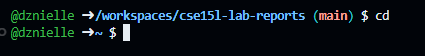

# Lab Report 1

1. `cd` no arguments 

2. `ls` no arguments

3. `cat` no arguments

4. `cd` with a path to a directory as an argument

5. `ls` with a path to a directory as an argument

6. `cat` with path to a directory as an argument

7. `cd` with a path to a file as an argument

8. `ls` with a path to a file as an argument

9. `cat` with a path to a file as an argument
