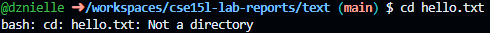

# Lab Report 1

1. `cd` no arguments 

Absolute Path:

2. `ls` no arguments

Absolute Path:

3. `cat` no arguments

Absolute Path:

4. `cd` with a path to a directory as an argument

Absolute Path: /workspaces/cse15

5. `ls` with a path to a directory as an argument

Absolute Path:

6. `cat` with path to a directory as an argument

Absolute Path:

7. `cd` with a path to a file as an argument

Absolute Path:

8. `ls` with a path to a file as an argument

Absolute Path:

9. `cat` with a path to a file as an argument

